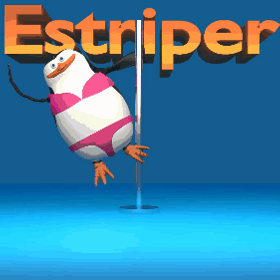

# Salutare 👋👋

- 

## Despre mine

Student la facultatea de Informatica si Matematica, profil Informatica Aplicata, anul II

Absolvent al Liceului Teoretic "Alexandru cel Bun"

## Domenii de interes

- Jocuri video, Retele de calculatoare

## Limbaje de programare  

- **Cunosc:** C++, Python, Java, C, JavaScript  
- **Învăț:** PHP  
- **Doresc să învăț:** C#

## Contact

- Posta electronica: <damianmorari@gmail.com>
- Facebook: <https://www.facebook.com/morari.gdsvs/>
